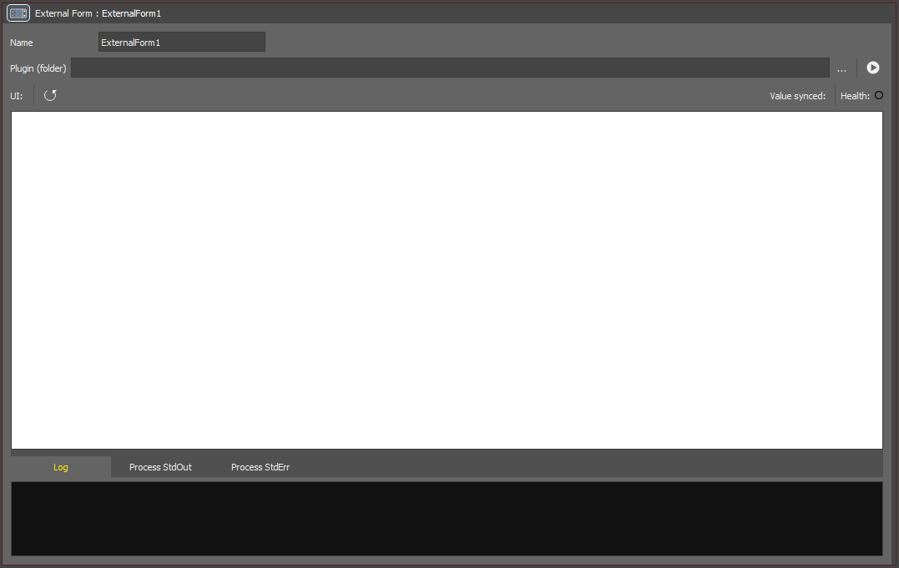
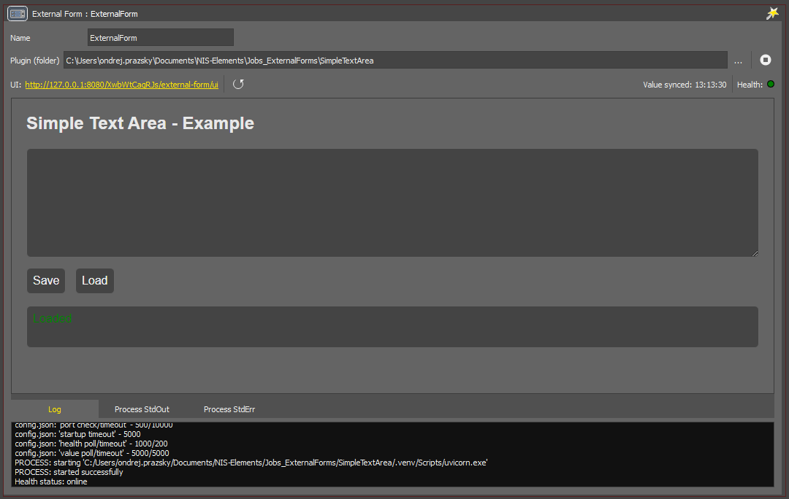
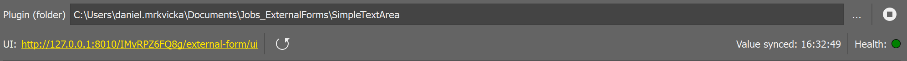
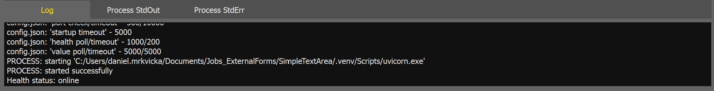

# Simple text area

This page describes how to use an `External Form` JOB task with a simple Python-based plugin. It also provides a minimal FastAPI example that serves an editor UI and synchronizes values with the task. This is example is minimalistic just to show the concept. The intended use is for more elaborated GUIs for manipulating fluidics
or robot control sequences.

> **External Form** task enables advanced users to program specific GUI in Python/HTML for a specific JOBS to reduce the complexity for regular users.
> The state that is managed by th GUI can be sent back to JOBS to be used by other Python tasks.

## Contents

- [Plugin setup](#plugin-setup)
- [External Form task](#external-form-task)
  - [Task setup](#task-setup)
  - [Task window](#task-window)
- [Plugin files](#plugin-files)
  - [`config.json`](#configjson)
  - [FastAPI application (`main.py`)](#fastapi-application-mainpy)

## Plugin setup

1. Make sure Python is installed and available in your system `PATH`.
This example was tested with Python 3.12.
2. Create a folder where the new plugin will be stored, for example:

```
C:\Users\<UserName>\Documents\Jobs_ExternalForms\SimpleTextArea
```

3. Open Command Prompt and change the working directory to the folder you created.
4. Create a Python virtual environment:

``` cmd
python -m venv .venv
```

5. Activate the virtual environment:

``` cmd
.\.venv\Scripts\activate.bat
```
6. Install FastAPI with Uvicorn and related standard dependencies:

```cmd
python -m pip install fastapi[standard] jinja2
```

7. Create the following file structure. The file contents are provided in the next section.

```
SimpleTextArea/
├── .venv/ (created in previous steps)
├── server/
│   ├── static/
│   │   ├── main.js
│   │   └── style.css
│   ├── templates/
│   │   └── index.html
│   └── main.py
└── config.json
```

The full example directory is available [here](./example_files/) an all files can be
[downloaded](https://lim-public-af010c85-0d3e-4156-9378-5adc1bbef7b3.s3.eu-central-1.amazonaws.com/GitHubAssets/JOBS_Examples/NIS_v7.01/63-Simple_text_area/example_files.zip) as single zip file.

## The task



The `External Form` task manages an external process, such as a Uvicorn server, that serves an HTML page containing the editor. It also ensures that edited values are synchronized back to the task node using HTTP requests and responses.

### Task setup

To set up the task, select the plugin folder using the `...` button. The Uvicorn server will then start, and the editor page will be displayed in the task window.



### Task window

Plugin selection and process monitoring are located at the top of the task window.



* Plugin selection and process control

    * `Plugin (folder)`: editable text field used to specify the plugin folder. The selected folder must contain a `config.json` file. When the plugin folder is changed, the server process is restarted automatically.

    * `...` *(ellipsis button)*: opens a folder selection dialog for choosing the plugin folder.

    * `▶️` / `⏹️` *(start/stop button)*: starts, stops, or restarts the Uvicorn server. <br> Before each launch, the `config.json` file is parsed to obtain the address and port exposed by the server. If the configured address is already in use, it usually means that another task using the same plugin is already running or that the server was started manually. In that case, the task waits for the port to become available before launching a new process. If the wait times out, it attempts to connect to the already running server instead.

* Process monitoring

    * `UI`: shows the current URL of the GUI page. Clicking the URL opens it in your web browser, where the editor can also be used.

    * `🔄` *(reload button)* : reloads the form.

    * `Value synced`: shows the time of the last successful synchronization from the server back to the JOB task. Synchronization between the application and the server usually runs at regular intervals, but edited values must first be saved from the browser to the server, either manually, for example by pressing a button on the page, or automatically through an autosave mechanism implemented in the page. In this example, a simple *Save* button is used.

    * `Health`: shows the current server status, provided that a health check URL is defined in `config.json`. Green indicates that the server is responding correctly, while orange or red indicates a problem or that the server is offline.

At the bottom of the window, there is a log section.



* **Log**: shows information logged by the JOB task. This information is also written to the application log file.
* **Process StdOut**: shows the standard output of the server process, if the process is managed by the task.
* **Process StdErr**: shows the standard error output of the server process, if the process is managed by the task.

## Plugin files

### `config.json`

The plugin behavior is defined by the `config.json` file. This file must always be located directly in the root folder of the plugin.

```json
{
    "api_version": "0.1",
    "name": "SimpleTextArea",
    "version": "1.0.0",
    "description": "Simple text area demo example",
    "endpoint": {
        "scheme": "http",
        "host": "127.0.0.1",
        "port": 8080
    },
    "routes": {
        "gui": "/{{TASK}}/external-form/ui",
        "value": "/{{TASK}}/external-form/value",
        "health": "/health"
    },
    "runtime": {
        "startup_port_check_ms": 500,
        "startup_port_timeout_ms": 10000,
        "startup_timeout_ms": 5000,
        "health_poll_ms": 1000,
        "health_timeout_ms": 200,
        "value_poll_ms": 5000,
        "value_timeout_ms": 5000
    },
    "server_process": {
        "program": "{{ROOT}}/.venv/Scripts/uvicorn.exe",
        "args": [
            "server.main:app",
            "--host", "{{HOST}}",
            "--port", "{{PORT}}"
        ]
    }
}
```

#### Description

```json
"name": "SimpleTextArea",
"version": "1.0.0",
"description": "Simple text area demo example",
```

`name`, `version`, and `description` are optional values that can help with plugin organization and its description.

#### Endpoint

```json
"endpoint": {
    "scheme": "http",
    "host": "127.0.0.1",
    "port": 8080
},
```

The `endpoint` section defines the server address and port. It must include `scheme`, `host`, and `port`. In this example, these values produce the address `http://127.0.0.1:8080`.

#### Paths

```json
"routes": {
    "gui": "/{{TASK}}/external-form/ui",
    "value": "/{{TASK}}/external-form/value",
    "health": "/health"
},
```

The `routes` defines the URLs used by the task to communicate with the server. These routes are appended to the base address specified in`endpoint`.

 The `{{TASK}}` template can be used within a path and is replaced at `runtime` with the unique task ID. The task ID changes each time the JOB is reopened. This is useful when a single server communicates with multiple tasks and needs to distinguish them using unique URLs.

* The `gui` path is required and specifies the URL that provides the editor page.
* The `value` path is required and specifies the URL used to synchronize the task value.
* The `health` path is optional and specifies the URL used to check whether the server is online.

#### Runtime

```json
"runtime": {
    "startup_port_check_ms": 500,
    "startup_port_timeout_ms": 10000,
    "startup_timeout_ms": 5000,
    "health_poll_ms": 1000,
    "health_timeout_ms": 200,
    "value_poll_ms": 5000,
    "value_timeout_ms": 5000
},
```

The ``runtime` is optional. It defines polling intervals and timeout values used by the plugin during startup, health checks, and value synchronization. The example below shows the default values. All values are in milliseconds.

* `startup_port_check_ms`: interval between checks whether the configured port is available before starting the server.
* `startup_port_timeout_ms`: maximum time to wait for the port to become available before giving up and trying to connect to an already running server.
* `startup_timeout_ms`: maximum time, in milliseconds, to wait for the server process to start successfully.
* `health_poll_ms`: interval between health status checks.
* `health_timeout_ms`: timeout for each health check request.
* `value_poll_ms`: interval between attempts to synchronize the value from the server back to the JOB task.
* `value_timeout_ms`: timeout for each value synchronization request.

#### Process

```json
"server_process": {
    "program": "{{ROOT}}/.venv/Scripts/uvicorn.exe",
    "args": [
        "server.main:app",
        "--host", "{{HOST}}",
        "--port", "{{PORT}}"
    ]
}
```

`process` is required and must contain the `program`. It may also contain the optional `args`. The program value must be a string, while args must be an array of strings. Both values may include templates, which are resolved at runtime.

* `{{ROOT}}`: absolute path to the root folder of the plugin
* `{{SCHEME}}`: scheme defined in `endpoint`, for example `http`
* `{{HOST}}`: host defined in `endpoint`, for example `127.0.0.1`
* `{{PORT}}`: port defined in `endpoint`, for example `8080`

In the example below, the configuration is resolved to: `C:/Users/<UserName>/Documents/Jobs_ExternalForms/SimpleTextArea/.venv/Scripts/uvicorn.exe server.main:app --host 127.0.0.1 --port 8080`

### FastAPI application (`main.py`)
The `main.py` file contains a simple FastAPI application that runs the example editor server. The server has three main responsibilities:

1. provide a health check endpoint so the task can verify that the server is running
2. serve the HTML page with the editor UI
3. provide an API for loading and saving the edited value

The server is started by Uvicorn, which is a web server commonly used to run FastAPI applications.

#### Imports
```python
from fastapi import FastAPI, Request
from fastapi.staticfiles import StaticFiles
from fastapi.templating import Jinja2Templates
from pydantic import BaseModel
from pathlib import Path
from typing import Any
```
These imports provide the basic building blocks used by the example.

#### Application creation

```python
app = FastAPI(title="External Form Example")
```

The `app` object is the main entry point of the server. Uvicorn uses it when starting the application. The `title` is optional and is mainly used for identification, for example in the automatically generated API documentation.

#### In-memory value storage

```python
job_task_values: dict[str, Any] = {}
```
This dictionary stores values by `job_task_id.` Each task is identified by its own unique ID, and the server uses that ID as a key. This allows one running server to store a separate value for each task.

#### Static file paths

```python
BASE_DIR = Path(__file__).resolve().parent
STATIC_DIR = BASE_DIR / "static"
```
These lines resolve the location of the current Python file and then build the path to the static folder.

This is useful because it allows the server to find the HTML and JavaScript files regardless of where the project folder is located on disk.

#### Static file mounting

```python
app.mount("/static", StaticFiles(directory=STATIC_DIR), name="static")
```
This makes the contents of the `static` folder available through the `/static` URL path.

For example, the file `server/static/external_form_ui.js` can be served by the server as `/static/external_form_ui.js`.

This is useful for frontend files such as JavaScript, CSS, images, or other resources needed by the HTML page.

#### Templates

Templates enable to pass the light|dark color scheme from the HTTP request header into the html code.

```python
templates = Jinja2Templates(directory=BASE_DIR / "templates")
```

#### Data model

```python
class ValueModel(BaseModel):
  value: Any
```

This defines the structure of the JSON body expected by the `POST` endpoint.

When the browser sends a value to the server, FastAPI uses this model to validate and parse the incoming JSON. In this example, the request body is expected to have the following structure: `{ "value": "JOB task value" }`

Using a model makes the API clearer and safer than reading raw JSON manually.

#### Health route

```python
@app.get("/health")
def health():
      return {"status": "ok"}
```
It is used to check whether the server is running and responding. When the task sends a request to `/health`,
the server returns a simple JSON response: `{ "status": "ok" }`.

This is used by the JOB task to display the current server status in the task window.

#### UI route

```python
@app.get("/{job_task_id}/external-form/ui")
def external_form_ui(job_task_id: str, request: Request):
    theme_header = request.headers.get("x-app-color-scheme", "light").lower()
    theme = "dark" if theme_header == "dark" else "light"

    return templates.TemplateResponse(
        request=request,
        name="index.html",
        context={ "theme": theme }
    )
```

This route serves the HTML page containing the editor UI.

The `job_task_id` is included in the URL so that the same server can handle multiple tasks independently. In this example, the ID is not used directly inside the Python function, but it remains part of the route so that each task has a unique URL. The ID is later parsed in the JavaScript code (`server/static/external_form_ui.js`) and used to synchronize the editor value with the correct JOB task.

The handler inspects the HTTP headers for `x-app-color-scheme`. NIS-Elements sets it to `light` or `dark`.
The it uses `jinja` to replace occurrences of `{{ theme }}` with the actual value from the header in the
`server/templates/index.html`.

The `style.css` is implemented in the way to handle both NIS-Elements color-scheme as well as Browsers theme.

#### Value read route

```python
@app.get("/{job_task_id}/external-form/value")
def get_value(job_task_id: str):
    return {"value": job_task_values.get(job_task_id, "")}
```

This route returns the current value stored for the selected task.

The `job_task_id` is used to look up the correct value in the dictionary. If no value has been saved yet, the endpoint returns an empty string.

This allows the page to load the current value when opened or refreshed.

#### Value write route

```python
@app.post("/{job_task_id}/external-form/value")
def set_value(job_task_id: str, model: ValueModel):
    job_task_values[job_task_id] = model.value
    return {"status": "ok"}
```
This route receives a new value from the browser and stores it for the given task.

The value is sent in JSON format and parsed using the `ValueModel` class. After the value is stored, the server returns a simple confirmation response: `{ "status": "ok" }`.

This endpoint is typically called when the user presses a *Save* button in the HTML page or when a value is sent from the JOB task to the server.