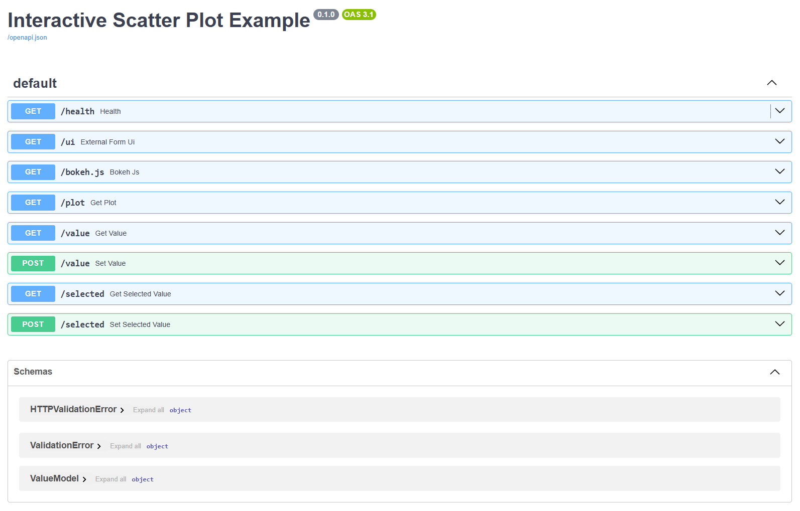

# Scatterplot server

# Installation

```bat
python -m venv .venv
.venv\Scripts\activate.bat
python -m pip install -r requirements.txt
```

# Run manually

```bat
.venv\Scripts\activate.bat
python main.py --host 127.0.0.1 --port 8080
```

# Overview

The server was programmed by LLM using [vibe coding](https://www.ibm.com/think/topics/vibe-coding).

It consists of two files:

1. `main.py` - which implements the FastAPI server and
2. `static/index.html` - the webpage that is shown on `/ui` endpoint.

The API can be inspected on the [/docs](http://127.0.0.1:8080/docs) endpoint when the server is running:



Where:
- **/health** - is used to check if the server is responding
- **/ui** - shows the graph
- **/bokeh.js** - returns the Bokeh JavaScript bundle needed by the static scatter plot page
- **/plot** - returns the Bokeh plot JSON that the static page embeds into the browser
- **/value** - sets/gets the actual complete point set
- **/selected** - sets/gets the filtered dataset
