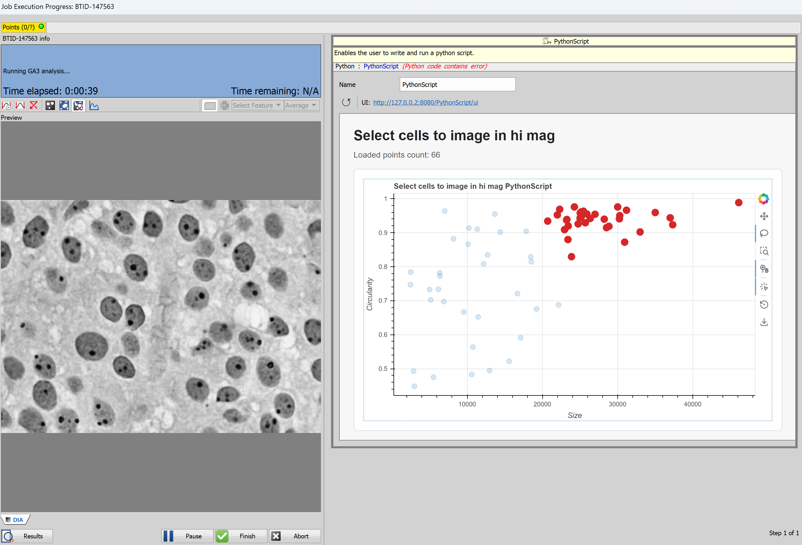
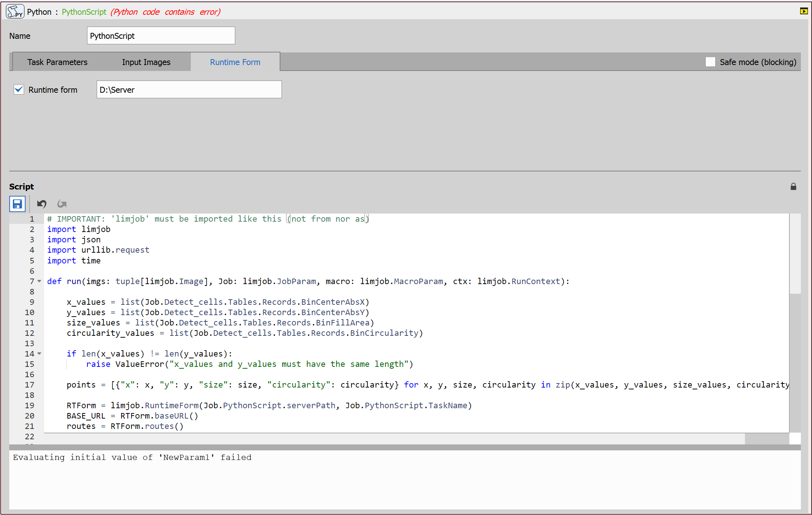

# Interactive scatter plot

This example demonstrates how to display a scatter plot in a runtime wizard of Python script JOB task to let the user select by gating which cells to acquire in high magnification.

This example is similar to the [Interactive scatter plot example](/NIS_v7.01/64-Interactive_scatter_plot/README.md) in version 7.01, but there are some modifications. The main difference is that there is no need to use a web browser to show the data now. In version 7.10 the Python script task was modified, so now it has an option to show the web window directly in its runtime wizard (in the `Runtime Form` tab).

Specifically it:
1. **Captures** a low magnification image with cells
2. Uses **GA3** task to detect the cells, measure their features (position, size, circularity) and populate a JOBS parameter with the list.
3. The **Python Script** task then
    - sends the list of features to the server,
    - while waiting the user can select different tools to gate the desired cells,
    - after user clicks "Done" the filtered list is returned back to the python task and
    - fills the point set for high magnification acquisition
4. The **Point loop** iterates over the selected points and captures the cells in high magnification.



## Server

1. [Download](https://lim-public-af010c85-0d3e-4156-9378-5adc1bbef7b3.s3.eu-central-1.amazonaws.com/GitHubAssets/JOBS_Examples/NIS_v7.01/64-Interactive_scatter_plot/scatterplot_server.zip) and unzip the [server](./scatterplot_server/) files into a folder. For example:

```bat
%userprofile%\Documents\scatterplot_server
```

2. Prepare the python (Python 3.12) venv, activate it and install required libraries

```bat
python -m venv .venv
.venv\Scripts\activate.bat
python -m pip install -r requirements.txt
```

3. Run it manually to see if it is working.

```bat
.venv\Scripts\activate.bat
python main.py --host 127.0.0.1 --port 8080
```

If everything was done correctly, you should see something like this in the command prompt:


If you navigate to the [web page](http:127.0.0.1:8080/ui) you should see an empty scatterplot.
It is OK as it is the JOBS that populates the points.

## JOBS

This is the minimalistic [job](https://laboratory-imaging.github.io/JOBS-examples/NIS_v7.01/64-Interactive_scatter_plot/Server_Example.html)
[[Download link](https://lim-public-af010c85-0d3e-4156-9378-5adc1bbef7b3.s3.eu-central-1.amazonaws.com/GitHubAssets/JOBS_Examples/NIS_v7.01/64-Interactive_scatter_plot/Server_Example.bin)].


The noteworthy parts is

- the GA3 and
- the Python Script

## GA3

The GA3 [recipe](https://laboratory-imaging.github.io/JOBS-examples/NIS_v7.01/64-Interactive_scatter_plot/Detect_cells.html)
[[Download link](https://lim-public-af010c85-0d3e-4156-9378-5adc1bbef7b3.s3.eu-central-1.amazonaws.com/GitHubAssets/JOBS_Examples/NIS_v7.01/64-Interactive_scatter_plot/Detect_cells.ga3)]
is simple too:

- Segmentation (Threshold) and
- Object measurement.


The Object measurement node has:
- Object Circularity, Object Fill Area - for the gating and
- Object Center Abs - X, Y - stage coordinates for the point set.


> [!IMPORTANT]
> Note the **column names** of relevant columns as they will be propagated to the JOBS parameter
> and then **Python Script task** uses these names to access the data.

## config.json file

The [config.json](/NIS_v7.10/64-Interactive_scatter_plot/scatterplot_server/static/config.json) file contains information about the server and is used to provide these informations to the `PythonScript` task and also to the Python script. This file can also contain information about preferred width of the runtime wizard GUI under the `optimal_width` value in the root of the file. The runtime wizard GUI will automatically adjust its width accordingly.

## Python task

The task uses the new parameters in the new `Runtime Form` tab, which are accessible in the script via `Job.PythonScript`. Uncheck the blocking checkbox so that the UI is responsible while waiting for the user to select the points.

> [!NOTE]
> The Init value content is evaluated by python `eval()` function do string must be in `""`.



The script is the most important part. See the [whole script](script.py). The limjob API was expanded by adding a new `RuntimeForm` object, which reads the config.json file and provides methods returning the base URL and routes and method `isStatusOK` returning true if the server is running and `ensureServerIsRunning` to ensure the server is running.

> [!NOTE]
> If the instance of the `limjob.RuntimeForm` object is named `RTForm`, then the autocomplete works on it.

1. Retrieve the data from the JOBS parameter.

```python
def run(imgs: tuple[limjob.Image], Job: limjob.JobParam, macro: limjob.MacroParam, ctx: limjob.RunContext):
    x_values = list(Job.Detect_cells.Tables.Records.BinCenterAbsX)
    y_values = list(Job.Detect_cells.Tables.Records.BinCenterAbsY)
    size_values = list(Job.Detect_cells.Tables.Records.BinFillArea)
    circularity_values = list(Job.Detect_cells.Tables.Records.BinCircularity)
```

2. Read the `config.json` file and get the base URL and routes from it:

```python
    RTForm = limjob.RuntimeForm(Job.PythonScript.serverPath, Job.PythonScript.TaskName)
    BASE_URL = RTForm.baseURL()
    routes = RTForm.routes()
```
3. Ensure the server is running using the `ensureServerIsRunning` function provided by the `RuntimeForm` object.

```python
    RTForm.ensureServerIsRunning()
```

4. Serialize the data into json and send it to the server using `POST` method on `http://127.0.0.1:8080/value` endpoint.

```python
    points = [{"x": x, "y": y, "size": size, "circularity": circularity} for x, y, size, circularity in zip(x_values, y_values, size_values, circularity_values)]
    urlValue = f"{BASE_URL}{routes["value"]}"
    urlSelected = f"{BASE_URL}{routes["selected"]}"
    data = json.dumps({"value": points}).encode("utf-8")
    request = urllib.request.Request(
        urlValue,
        data=data,
        headers={"Content-Type": "application/json"},
        method="POST",
    )
```

5. Wait for the server response to a `GET` method on `http://127.0.0.1:8080/selected` endpoint. If the `Runtime form` checkbox is unchecked, then the selected points are set to all points.

```python
    with urllib.request.urlopen(request) as response:
        response.read()
    
    xPointsSelected = []
    yPointsSelected = []
    if (Job.PythonScript.isRuntimeForm):
        while not ctx.shouldAbort:
            with urllib.request.urlopen(urlSelected, timeout=5) as response:
                dataSelected = json.loads(response.read().decode("utf-8"))
    
            selectedPoints = dataSelected.get("value")
    
            if isinstance(selectedPoints, list) and len(selectedPoints) > 0:
                print("Points:", selectedPoints)
                xPointsSelected = [point["x"] for point in selectedPoints]
                yPointsSelected = [point["y"] for point in selectedPoints]
                break
            
            time.sleep(1)
    else:
        xPointsSelected = x_values
        yPointsSelected = y_values
```

6. Fill the point set with the points returned from the server.

```python
    Job.NewPointSet.PointSet.set(xPointsSelected, yPointsSelected)
```